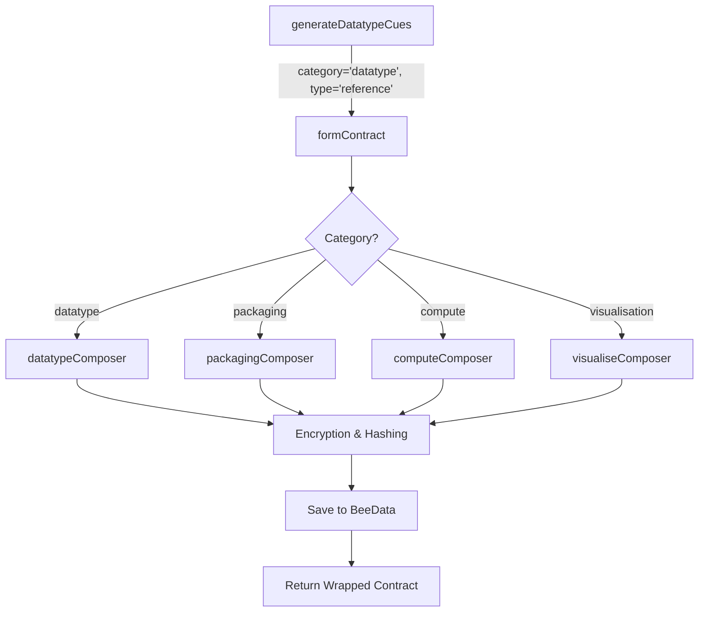

# Restructuring Plan for `src/glue/cogGlue.js`

The goal is to restructure the `CogGlue` class to handle multiple contract types (`datatype`, `packaging`, `compute`, `visualisation`) and support both `reference` and `module` contract forms.

## Proposed Changes

### 1. `formContract(category, type, mark)`
- **category**: The type of contract (e.g., `datatype`, `packaging`, `compute`, `visualisation`).
- **type**: Whether it's a `reference` or `module` contract.
- **mark**: The data payload.

The method will use `this.libComposer.liveComposer` to call the appropriate composer based on the `category`.

### 2. `generateDatatypeCues()`
- Update to pass the correct `category` ('datatype') and `type` ('reference') to `formContract`.

### 3. `cueFormer(mark, storageKey, categoryColors)`
- Ensure it correctly uses the `storageKey` from the formed contract.

## Mermaid Diagram

## Implementation Steps
1. Modify `formContract` to accept `category` and `type`.
2. Add logic to select the composer based on `category`.
3. Update `generateDatatypeCues` to use the new signature.
4. Refactor `cueFormer` to handle the updated flow.
