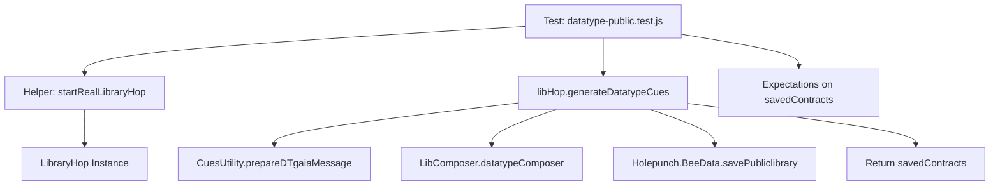

# Plan: Review and Fix `test/batch/datatype-public.test.js`

The goal is to ensure the `datatype-public.test.js` correctly tests the `generateDatatypeCues` method in `LibraryHop` following the new folder structure and API changes.

## Current State Analysis
- **Test File**: `test/batch/datatype-public.test.js` expects `libHop.generateDatatypeCues()` to return an array of saved contracts.
- **Implementation**: `src/index.js`'s `generateDatatypeCues` currently returns `true` and logs the results instead of returning them.
- **Helper**: `test/helpers.js` provides `startRealLibraryHop()` which seems correctly set up for integration testing.

## Proposed Changes

### 1. Update `src/index.js`
Modify `generateDatatypeCues` to return the `saveDatatypeRC` (the list of saved reference contracts) instead of just `true`. This makes the method more testable and useful.

### 2. Update `test/batch/datatype-public.test.js`
- Ensure imports are correct.
- Adjust expectations to match the actual structure of the returned contracts from `holepunch-hop` (which usually includes `key` and `value`).

## Mermaid Diagram of Workflow

## Todo List
1. [ ] Switch to **Code** mode.
2. [ ] Modify `src/index.js`: Update `generateDatatypeCues` to return `saveDatatypeRC`.
3. [ ] Modify `test/batch/datatype-public.test.js`:
    - Update expectations to handle the `key`/`value` structure returned by the datastore.
    - Add more specific assertions if needed.
4. [ ] Run tests using `vitest`.
