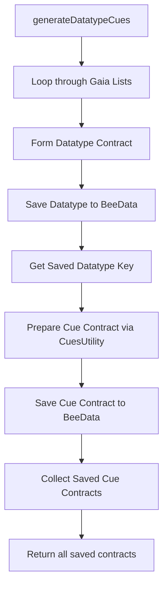

# Plan: Upgrade Datatypes to Cue Contracts

The goal is to complete the implementation of `generateDatatypeCues` in `src/index.js`. Currently, it generates and saves `datatype` contracts. We need to "upgrade" these to `cue` contracts, which include the datatype reference, a color, and relationships.

## Proposed Workflow

1.  **Iterate through generated Datatypes**: After a `datatype` is saved in `generateDatatypeCues`, use its returned `key` and metadata.
2.  **Prepare Cue Contract**: Use `this.cuesUtility.prepareCuesContractPrime` to create the cue structure.
    *   `name`: From the datatype.
    *   `color`: Assign a color (e.g., from the `mark` data if available, or a default).
    *   `datatype`: The `storageKey` of the saved datatype.
3.  **Save Cue Contract**: Call `this.liveHolepunch.BeeData.saveCues` (or the appropriate public library save method) to persist the cue.
4.  **Update BentoBoxDS**: Ensure the resulting contracts are available for the frontend/BentoBoxDS.

## Mermaid Diagram

## Todo List

- [ ] Define default color mapping for Gaia categories in `src/index.js` or `cuesUtility.js`.
- [ ] Modify `src/index.js:1244` to call `prepareCuesContractPrime`.
- [ ] Implement the save logic for the new cue contracts.
- [ ] Verify that `BentoBoxDS` receives these upgraded cues via the existing callback mechanisms.
- [ ] Add a test case in `test/new/datatype-new.test.js` that specifically checks for the cue upgrade.

Does this plan look correct to you? I can proceed to implement this in Code mode once approved.
