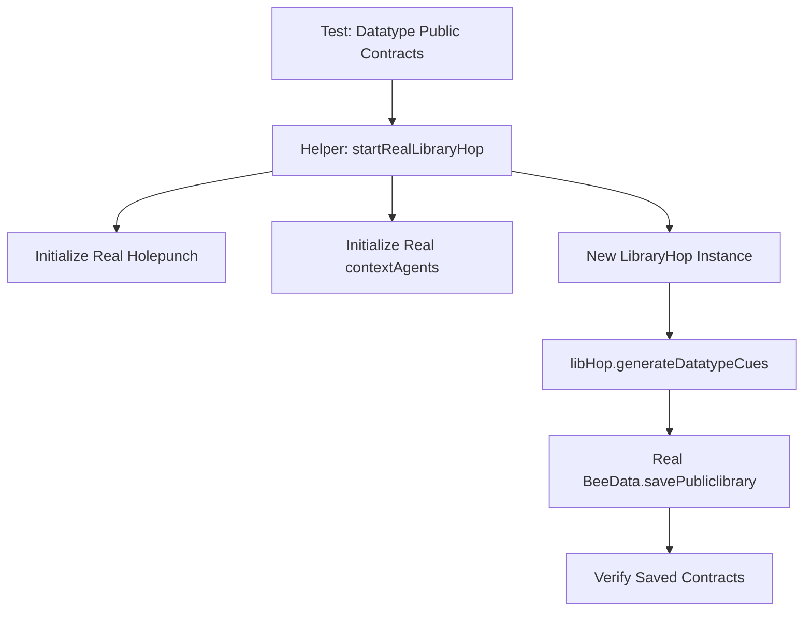

# Plan: Real Instance Testing for Datatype Contracts

The goal is to replace the mocked Holepunch/BeeData in `test/datatype-public.test.js` with a real instance of `LibraryHop` that uses actual underlying services.

## Proposed Changes

### 1. Create `test/helpers.js`
This file will contain a helper function to initialize a real `LibraryHop` instance. It will likely need to:
- Import `LibraryHop` from `../src/index.js`.
- Import real `Holepunch` and `contextAgents` (or equivalent) from the `hop` repository.
- Provide a way to clean up or reset the state if needed.

### 2. Update `test/datatype-public.test.js`
- Remove the `vi.fn()` mocks for `Holepunch` and `BeeData`.
- Use the helper function to get a real `libHop` instance.
- Update assertions to reflect real data behavior (e.g., checking if data was actually written to the hyperbee).

## Mermaid Diagram

## Next Steps
1. Switch to **Code** mode.
2. Create `test/helpers.js`.
3. Modify `test/datatype-public.test.js`.
4. Run tests to verify.
