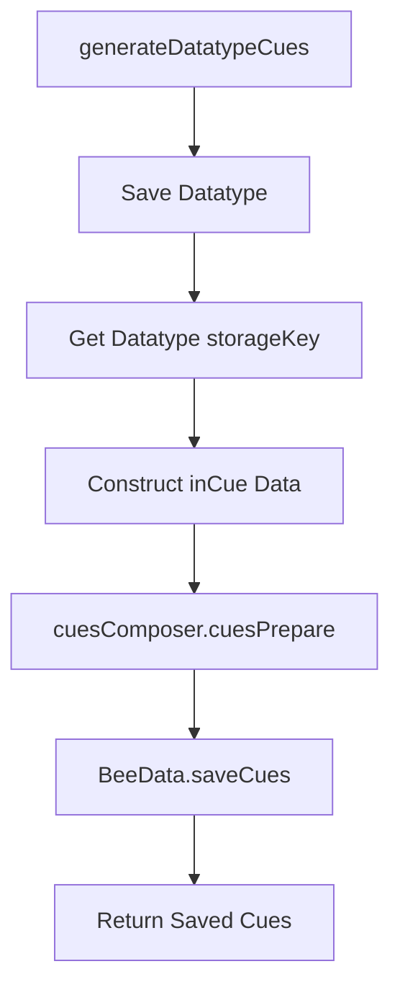

# Plan: Upgrade Datatypes to Cue Contracts (v2 Alignment)

This plan outlines the implementation of the "upgrade" stage in `generateDatatypeCues`, transitioning from v1 Datatype Reference Contracts to v2 Cue Contracts.

## Cue Contract Structure (v2)
The contract will be formed using `CuesComposer.cuesPrepare`, which utilizes `CuesContract.cuesContractform`.

```json
{
  "refcontract": "cue",
  "concept": {
    "name": "string",
    "cueSpaceID": "gaia!nature!universe",
    "appearance": { "color": "#hex" }
  },
  "space": { "concept": "mind" },
  "computational": {
    "datatypeRef": "storageKey_from_datatype",
    "relationships": []
  },
  "time": {
    "createTimestamp": "helistamp",
    "lastTimestamp": "helistamp",
    "frequencyCount": 0
  }
}
```

## Implementation Steps

1.  **Modify `generateDatatypeCues` in `src/index.js`**:
    *   After saving a `datatype`, capture its `storageKey`.
    *   Construct an `inCue` object:
        *   `concept`: Include `name` (from `mark.data`), `cueSpaceID` (mapped from category), and `appearance.color`.
        *   `computational`: Include `datatypeRef` (the `storageKey`).
    *   Call `this.libComposer.liveCues.cuesPrepare({ data: inCue })`.
2.  **Save to BeeData**:
    *   Use `this.liveHolepunch.BeeData.saveCues(formedCue)`.
3.  **Verification**:
    *   Ensure `savedContracts` includes both the datatype and the upgraded cue.
    *   Update `test/new/datatype-new.test.js` to verify the `cue` contract creation.

## Mermaid Workflow



## Todo List

- [x] Analyze `generateDatatypeCues` in `src/index.js`
- [x] Review `CuesComposer` and `CuesContracts` for v2 schema alignment
- [ ] Implement the upgrade loop in `src/index.js`
- [ ] Map Gaia categories to `cueSpaceID` and colors
- [ ] Update tests to verify `cue` contract presence and structure

Does this plan look correct? I'm ready to switch to Code mode.
